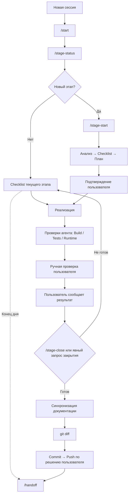

# Development Workflow

Разработка AI News Bot ведётся крупными этапами из [ROADMAP.md](./ROADMAP.md). Каждый этап проходит единый цикл:

**Анализ → Checklist → План → Реализация → Verification → Закрытие этапа**

Git хранит историю изменений, а проектная документация отражает текущее фактически подтверждённое состояние.

## Основные документы

- [`AGENTS.md`](../AGENTS.md) — нормативные правила поведения AI-агента. При расхождениях имеет приоритет над этим документом.
- [`docs/DEVELOPMENT_WORKFLOW.md`](./DEVELOPMENT_WORKFLOW.md) — человекочитаемое описание полного процесса разработки.
- [`docs/DAILY_WORKFLOW.md`](./DAILY_WORKFLOW.md) — короткая ежедневная инструкция для пользователя.
- [`docs/ROADMAP.md`](./ROADMAP.md) — канонические крупные этапы, их статусы и текущий фокус.
- [`docs/ROADMAP_VISUAL.md`](./ROADMAP_VISUAL.md) — производное визуальное представление roadmap.
- [`docs/CURRENT_STATE.md`](./CURRENT_STATE.md) — фактически подтверждённое текущее состояние проекта.
- [`docs/BACKLOG.md`](./BACKLOG.md) — ближайшие и последующие операционные задачи.
- [`docs/DECISIONS.md`](./DECISIONS.md) — принятые и открытые архитектурные решения.
- [`docs/checklists/`](./checklists/) — один актуальный checklist на каждый начатый этап.

`DEVELOPMENT_WORKFLOW.md` описывает процесс, но не является источником статусов проекта, архитектурных решений или продуктовых требований.

## Жизненный цикл этапа

1. **Восстановление контекста** — `/start` читает проектную документацию, а `/stage-status` показывает текущий этап, точку остановки, блокеры и Git.
2. **Анализ этапа** — изучаются roadmap, состояние, backlog, решения, архитектура, релевантный код и зависимости.
3. **Формирование checklist** — после анализа и до реализации создаётся или актуализируется единственный checklist этапа.
4. **План реализации** — определяется последовательность крупных изменений и проверок.
5. **Подтверждение пользователем** — после `/stage-start` агент останавливается до явного разрешения начать реализацию.
6. **Реализация** — агент изменяет код в согласованном scope и не дублирует существующие возможности.
7. **Build/Test Verification агента** — выполняются build, lint и применимые тесты.
8. **Runtime Verification агента** — агент фактически проверяет доступные ему внешние интеграции и runtime-поведение этапа.
9. **Ручная проверка пользователем** — пользователь выполняет отдельный пошаговый раздел checklist и явно сообщает результат; это закрывает пользовательские пункты, но не сам этап.
10. **Явное закрытие этапа** — пользователь вызывает `/stage-close` или отдельно просит закрыть этап.
11. **Закрытие checklist** — обязательные пункты отмечаются выполненными только по подтверждённым результатам.
12. **Repository-wide синхронизация документации** — проверяются все применимые документы и конфигурационные поверхности, а не только основные source-of-truth файлы.
13. **Проверка Git** — просматриваются `git status` и финальный `git diff`, проверяется отсутствие секретов и посторонних изменений.
14. **Commit / Push** — выполняются агентом только после явного решения пользователя.

Checklist является живым документом текущего этапа и может уточняться при изменении требований, scope или обязательных проверок. Историю checklist хранит Git; changelog внутри файла не ведётся.

В каждом checklist проверки разделяются на **«Что тестирует агент»** и **«Что пользователь тестирует вручную»**. Пользовательская часть содержит конкретные действия и ожидаемые результаты и закрывается только после явного подтверждения пользователя.

Если ручная проверка выявила дефект, затронутые acceptance-пункты открываются повторно. После исправления заново выполняются применимые build/test/runtime-проверки, пользовательский retest, документационный аудит и diff review.

Мелкие задачи не добавляются в roadmap. Они остаются в checklist, backlog или current state в зависимости от назначения.

`Build-Verified` не означает `Runtime-Verified`. Этап нельзя закрыть без выполнения обязательной verification и критерия завершения из roadmap.

## Визуальная схема



## Начало рабочего дня

1. Открыть проект.
2. Запустить OpenCode.
3. Выполнить `/start`.
4. Выполнить `/stage-status`.

После этого должны быть понятны текущий этап, точка остановки, следующий шаг, блокеры, открытые решения и состояние Git.

## Продолжение активного этапа

Если этап уже корректно начат:

1. Выполнить `/start` и `/stage-status`.
2. Посмотреть checklist текущего этапа.
3. Дать агенту следующую задачу обычным языком.
4. После реализации агент выполняет свой раздел verification, затем пользователь проходит отдельный ручной раздел checklist и сообщает результат.
5. Сообщение результата не закрывает этап автоматически; для закрытия вызывается `/stage-close` или даётся отдельная явная команда.

Повторно выполнять `/stage-start` не нужно, если не требуется новый stage-specific анализ или существенная актуализация scope.

## Начало нового этапа

Для начала этапа используется `/stage-start`. Команда:

- проводит stage-specific анализ;
- проверяет зависимости;
- определяет scope и out-of-scope;
- выявляет архитектурные решения;
- создаёт или актуализирует единственный checklist;
- формирует план реализации.

После отчёта `/stage-start` агент останавливается. Реализация начинается только после явного подтверждения пользователя.

## Во время разработки

Пользователь задаёт направление, требования и решения по архитектурным развилкам.

Агент изучает существующий код, реализует изменения, устанавливает необходимые зависимости, запускает проверки, исправляет ошибки и поддерживает документацию в актуальном состоянии.

Если возникает существенное решение, способное повлиять на архитектуру, данные, интеграции или следующие этапы, применяется Decision Gate из `AGENTS.md`: агент показывает варианты и ждёт решения пользователя. Мелкие implementation details агент выбирает самостоятельно.

## Проверка этапа

### 1. Что тестирует агент

#### Build Verification

- `npm run build`;
- `npm run lint`;
- тесты, если они существуют или требуются этапом.

#### Runtime Verification

- реальные внешние интеграции;
- Telegram;
- PostgreSQL;
- RSS/API и другие внешние сервисы;
- scheduler и фоновые задачи;
- другие runtime-зависимости конкретного этапа.

Успешный build подтверждает корректность сборки, но не подтверждает runtime-поведение.

### 2. Что пользователь тестирует вручную

- выполняет пошаговые действия из checklist в реальном интерфейсе или окружении;
- сверяет фактическое поведение с указанными ожидаемыми результатами;
- сообщает агенту успешный результат или безопасные диагностические данные без секретов;
- только после этого пользовательские пункты могут быть отмечены выполненными.

## Закрытие этапа

Для проверки готовности используется `/stage-close`. Команда сверяет:

- фактическую реализацию с checklist;
- build, lint и применимые тесты;
- обязательную Runtime Verification;
- явное подтверждение обязательной ручной проверки пользователем;
- критерий завершения из `ROADMAP.md`;
- актуальность документации и архитектурных решений.

Если обязательные проверки не выполнены, этап остаётся незавершённым и получает список конкретных открытых пунктов.

Если всё подтверждено:

1. Checklist отмечается завершённым.
2. `CURRENT_STATE.md` синхронизируется.
3. `BACKLOG.md` синхронизируется.
4. Канонический `ROADMAP.md` обновляется.
5. `ROADMAP_VISUAL.md` синхронизируется с roadmap.
6. `DECISIONS.md` обновляется, если появились новые решения.
7. Выполняется repository-wide аудит применимых файлов: `README.md`, product/architecture/state/backlog/decisions, roadmap, checklist, а при изменении конфигурации — `.env.example`, Docker и package scripts.
8. Ищутся устаревшие placeholders, статусы, operational instructions и точные количества; проверяются локальные Markdown-ссылки и финальный diff.

Закрытые checklist сохраняют scope и подтверждённые факты своего этапа. При этом их неограниченные по времени инструкции и описания текущего поведения должны обновляться или явно помечаться как заменённые последующим этапом, если стали ложными.

Нельзя утверждать «все файлы синхронизированы» после выборочного просмотра. В отчёте указывается фактический охват аудита и исключения; generated files, зависимости и секретный `.env` не входят в документационный аудит.

## Git

Типичный цикл:

```text
git status
→ git diff
→ проверка пользователем
→ git add
→ commit
→ push
```

Commit и push выполняются только после явного решения пользователя. Секреты, токены, пароли, ключи и `.env` никогда не должны попадать в commit.

## Завершение рабочего дня

Для завершения сессии используется `/handoff`. Его цель — оставить код и документацию в понятном состоянии для следующей сессии или другой модели.

После handoff:

1. Проверить `git status`.
2. Убедиться, что изменения ожидаемы.
3. При необходимости явно поручить агенту commit.
4. При необходимости отдельно поручить push.

## Основные команды

| Команда | Назначение |
|---------|------------|
| `/start` | Восстановить или обновить общий контекст проекта. |
| `/stage-status` | Быстро понять текущее состояние и следующее действие. Read-only. |
| `/stage-start` | Начать новый крупный этап через анализ, checklist и план. |
| `/stage-close` | Проверить Definition of Done и закрыть этап либо показать открытые пункты. |
| `/handoff` | Корректно завершить рабочую сессию и подготовить контекст для продолжения. |

## Короткая схема принятия решения

```text
Не знаю, где остановился?       → /stage-status
Начинаю новый этап?             → /stage-start
Продолжаю существующий этап?    → checklist → следующая задача
Думаю, что этап закончен?       → /stage-close
Заканчиваю работу на сегодня?   → /handoff
```

## Иерархия source of truth

| Источник | Ответственность |
|----------|-----------------|
| `AGENTS.md` | Правила поведения AI-агента. |
| `ROADMAP.md` | Крупные этапы и их статусы. |
| `CURRENT_STATE.md` | Фактически подтверждённое состояние. |
| `BACKLOG.md` | Операционные задачи. |
| `DECISIONS.md` | Архитектурные решения. |
| `checklists/` | Критерии конкретного этапа. |
| `DEVELOPMENT_WORKFLOW.md` | Человекочитаемое описание процесса разработки. |
| `DAILY_WORKFLOW.md` | Краткая пользовательская шпаргалка. |
| `ROADMAP_VISUAL.md` | Производная визуализация roadmap. |
