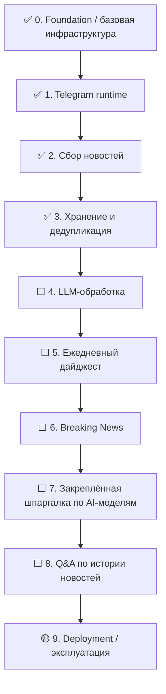

# AI News Bot — Visual Roadmap

Это компактное визуальное представление проекта для просмотра в Obsidian. Канонический roadmap находится в [ROADMAP.md](./ROADMAP.md).

## Сейчас

- **Текущий этап:** 4. LLM-обработка
- **Статус:** ⬜ Запланировано
- **Подтверждено:** этап 3 завершён; persistence, insert-only дедупликация и `/latest` проверены агентом и пользователем на реальных данных PostgreSQL и Telegram.
- **Следующий крупный milestone:** выбрать LLM-провайдера, подготовить checklist этапа 4 и реализовать суммаризацию, оценку важности и тематическую классификацию.

## Карта этапов

## Этапы кратко

- ✅ 0. Foundation / базовая инфраструктура
- ✅ 1. Telegram runtime
- ✅ 2. Сбор новостей
- ✅ 3. Хранение и дедупликация
- ⬜ 4. LLM-обработка
- ⬜ 5. Ежедневный дайджест
- ⬜ 6. Breaking News
- ⬜ 7. Закреплённая шпаргалка по AI-моделям
- ⬜ 8. Q&A по истории новостей
- 🟡 9. Deployment / эксплуатация

## Быстрые ссылки

- [Roadmap](./ROADMAP.md)
- [Current State](./CURRENT_STATE.md)
- [Backlog](./BACKLOG.md)
- [Architecture](./ARCHITECTURE.md)
- [Decisions](./DECISIONS.md)
